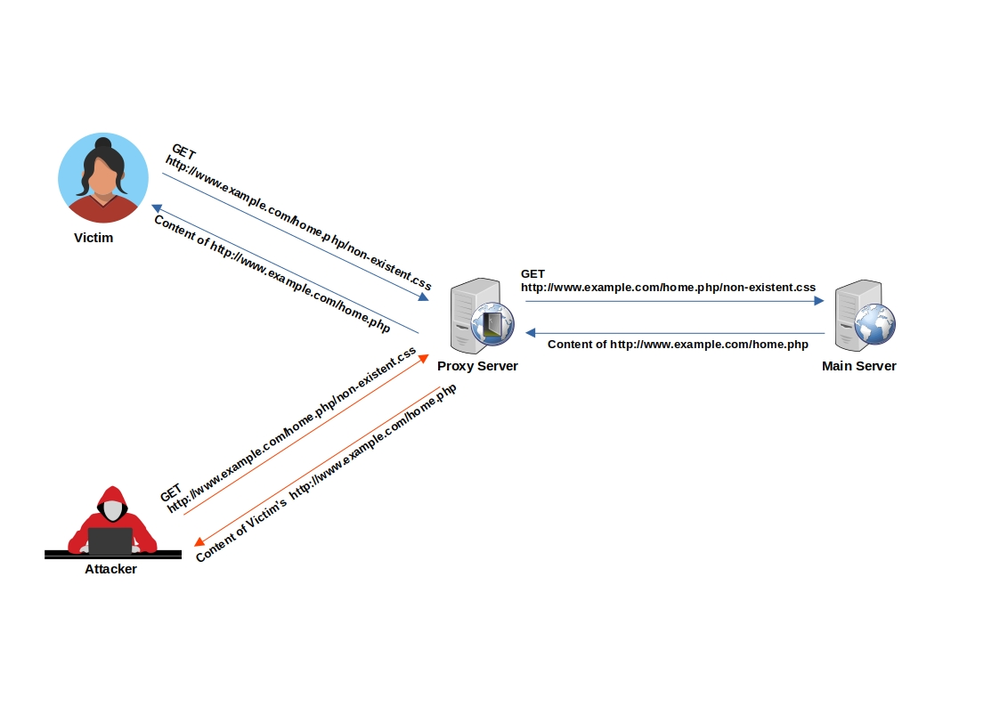

# 网页缓存欺骗

> 网页缓存欺骗（WCD）是一种安全漏洞，当网络服务器或缓存代理错误解释客户端对网页资源的请求，并随后提供一个不同的资源（通常是更敏感或私密的信息）并缓存它时发生。

## 概要

* [工具](#工具)
* [方法论](#方法论)
    * [缓存敏感数据](#缓存敏感数据)
    * [缓存自定义JavaScript](#缓存自定义JavaScript)
* [CloudFlare缓存](#cloudflare缓存)
* [实验](#实验)
* [参考文献](#参考文献)

## 工具

* [PortSwigger/param-miner](https://github.com/PortSwigger/param-miner) - Web Cache Poisoning Burp扩展插件

## 方法论

### 网页缓存欺骗示例：

想象一下攻击者诱使已登录的受害者访问 `http://www.example.com/home.php/non-existent.css`

1. 受害者的浏览器请求资源 `http://www.example.com/home.php/non-existent.css`
2. 在缓存服务器中搜索请求的资源，但未找到（资源不在缓存中）。
3. 请求被转发到主服务器。
4. 主服务器返回 `http://www.example.com/home.php` 的内容，通常带有指示不缓存此页面的HTTP缓存头。
5. 响应通过缓存服务器。
6. 缓存服务器识别出文件具有CSS扩展名。
7. 在缓存目录下，缓存服务器创建一个名为 home.php 的目录，并在其中缓存假冒的“CSS”文件（non-existent.css）。
8. 当攻击者请求 `http://www.example.com/home.php/non-existent.css` 时，请求被发送到缓存服务器，缓存服务器返回包含受害者敏感 `home.php` 数据的缓存文件。



### 缓存敏感数据

**示例1** - PayPal首页上的网页缓存欺骗

1. 正常浏览，访问主页：`https://www.example.com/myaccount/home/`
2. 打开恶意链接：`https://www.example.com/myaccount/home/malicious.css`
3. 页面显示为 /home 并缓存页面
4. 打开一个私人标签页并访问之前的URL：`https://www.example.com/myaccount/home/malicious.css`
5. 显示缓存的内容

Omer Gil演示的攻击视频 - PayPal首页上的网页缓存欺骗攻击
[](https://vimeo.com/249130093)

**示例2** - OpenAI上的网页缓存欺骗

1. 攻击者精心制作 `/api/auth/session` 端点的专用 .css 路径。
2. 攻击者分发链接。
3. 受害者访问合法链接。
4. 响应被缓存。
5. 攻击者获取JWT凭据。

### 缓存自定义JavaScript

1. 查找缓存中毒的未键入输入

    ```js
    值：User-Agent
    值：Cookie
    标头：X-Forwarded-Host
    标头：X-Host
    标头：X-Forwarded-Server
    标头：X-Forwarded-Scheme (标头；也可以与X-Forwarded-Host结合使用)
    标头：X-Original-URL (Symfony)
    标头：X-Rewrite-URL (Symfony)
    ```

2. 缓存中毒攻击 - 示例 `X-Forwarded-Host` 未键入输入（记住使用buster来仅缓存此网页而不是网站的主页）

    ```js
    GET /test?buster=123 HTTP/1.1
    Host: target.com
    X-Forwarded-Host: test"><script>alert(1)</script>

    HTTP/1.1 200 OK
    Cache-Control: public, no-cache
    [..]
    <meta property="og:image" content="https://test"><script>alert(1)</script>">
    ```

## 技巧

以下URL格式是检查“缓存”功能的良好起点。

* `https://example.com/app/conversation/.js?test`
* `https://example.com/app/conversation/;.js`
* `https://example.com/home.php/non-existent.css`

## CloudFlare缓存

当 `Cache-Control` 头部设置为 `public` 且 `max-age` 大于0时，CloudFlare会缓存资源。

* 默认情况下，Cloudflare CDN不会缓存HTML
* Cloudflare仅根据文件扩展名进行缓存，而不是根据MIME类型：[cloudflare/default-cache-behavior](https://developers.cloudflare.com/cache/about/default-cache-behavior/)

在Cloudflare CDN中，可以实现“缓存欺骗防护”，默认情况下该功能未启用。
当启用“缓存欺骗防护”时，规则会验证URL的扩展名是否与返回的 `Content-Type` 匹配。

CloudFlare有一份默认扩展名列表，在其负载均衡器后面被缓存。

|       |      |      |      |      |       |      |
|-------|------|------|------|------|-------|------|
| 7Z    | CSV  | GIF  | MIDI | PNG  | TIF   | ZIP  |
| AVI   | DOC  | GZ   | MKV  | PPT  | TIFF  | ZST  |
| AVIF  | DOCX | ICO  | MP3  | PPTX | TTF   | CSS  |
| APK   | DMG  | ISO  | MP4  | PS   | WEBM  | FLAC |
| BIN   | EJS  | JPG  | OTF  | RAR  | WEBP  | MID  |
| BMP   | EOT  | JPEG | PDF  | SVG  | WOFF  | PLS  |
| BZ2   | EPS  | JPEG | PNG  | SVGZ | WOFF2 | TAR  |
| CLASS | EXE  | JS   | PICT | SWF  | XLS   | XLSX |

例外和绕过情况：

* 如果返回的 `Content-Type` 是 `application/octet-stream`，扩展名无关紧要，因为这通常是一个信号，指示浏览器保存资产而不是显示它。
* Cloudflare允许 .jpg 作为 image/webp 或 .gif 作为 video/webm 等情况，我们认为这些不太可能是攻击。
* [利用 .avif 扩展文件绕过缓存欺骗防护 - 修复](https://hackerone.com/reports/1391635)

## 实验

* [PortSwigger Labs for Web Cache Deception](https://portswigger.net/web-security/all-labs#web-cache-poisoning)

## 参考文献

* [缓存欺骗防护 - Cloudflare - 2023年5月20日](https://developers.cloudflare.com/cache/cache-security/cache-deception-armor/)
* [利用缓存设计缺陷 - PortSwigger - 2020年5月4日](https://portswigger.net/web-security/web-cache-poisoning/exploiting-design-flaws)
* [利用缓存实现缺陷 - PortSwigger - 2020年5月4日](https://portswigger.net/web-security/web-cache-poisoning/exploiting-implementation-flaws)
* [如何测试网页缓存漏洞+技巧和窍门 - bombon (0xbxmbn) - 2022年7月21日](https://bxmbn.medium.com/how-i-test-for-web-cache-vulnerabilities-tips-and-tricks-9b138da08ff9)
* [OpenAI账户接管 - Nagli (@naglinagli) - 2023年3月24日](https://twitter.com/naglinagli/status/1639343866313601024)
* [实用的网页缓存中毒 - James Kettle (@albinowax) - 2018年8月9日](https://portswigger.net/blog/practical-web-cache-poisoning)
* [Shockwave识别OpenAI ChatGPT影响的网页缓存欺骗和账户接管漏洞 - Nagli (@naglinagli) - 2024年7月15日](https://www.shockwave.cloud/blog/shockwave-works-with-openai-to-fix-critical-chatgpt-vulnerability)
* [网页缓存欺骗攻击 - Omer Gil - 2017年2月27日](http://omergil.blogspot.fr/2017/02/web-cache-deception-attack.html)
* [网页缓存欺骗攻击导致用户信息泄露 - Kunal Pandey (@kunal94) - 2019年2月25日](https://medium.com/@kunal94/web-cache-deception-attack-leads-to-user-info-disclosure-805318f7bb29)
* [网页缓存纠缠：中毒的新途径 - James Kettle (@albinowax) - 2020年8月5日](https://portswigger.net/research/web-cache-entanglement)
* [网页缓存中毒 - PortSwigger - 2020年5月4日](https://portswigger.net/web-security/web-cache-poisoning)